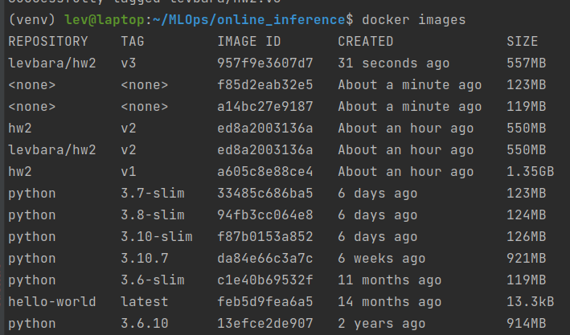
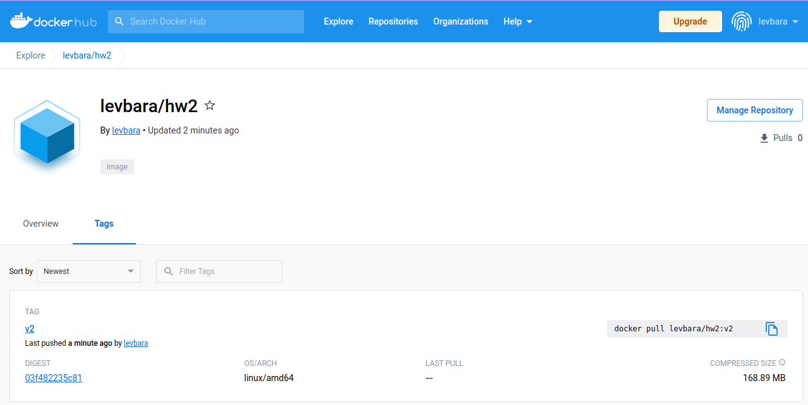

# ДЗ2 - Online Inference

## Барабанщиков Лев, Технопарк ML-21

## Перед запуском

- Рекомендованная версия Python: 3.10

- Все команды следует запускать из папки `online_inference`

## Запуск с помощью Docker

### Локальная сборка

```bash
docker build --rm -t hw2:v2 .
docker run --rm -p 8000:8000 hw2:v2
```

### Загрузка с DockerHub

```bash
docker pull levbara/hw2:v2
docker run --rm -p 8000:8000 levbara/hw2:v2
```

## Установка (для локального запуска)

```bash
python3 -m venv .venv
source .venv/bin/activate
pip install -r requirements.txt
```

## Локальный запуск

Инициализируйте переменную окружения `MODEL_URL` ссылкой на папку с моделью в Google Drive. Указав URL для скачивания
модели, можно развернуть приложение:

```bash
export MODEL_URL="https://drive.google.com/drive/folders/1ItBIA7whRu3G9FHn3VObTdLNiCA-xy_V?usp=share_link"
python3 app.py
```

## Использование скрипта

Скрипт скачивает датасет с Google Drive и посылает его на inference. Для запуска по умолчанию, инициализируйте
переменную окружения. Если запускаете приложение из консоли, то выполняйте скрипт в другом терминале :)

```bash
export DS_URL="https://drive.google.com/drive/folders/1UmZjYMQ5srKSA_5yASab3w5S9UjKtXQy?usp=share_link"
python3 script.py
```

Можно задать свой датасет, ip и порт инференса:

```bash
python3 script.py -d not_heart_cleveland_upload.csv -i 0.0.0.0 -p 8000
```

или

```bash
python3 script.py --ds_filename not_heart_cleveland_upload.csv --ip 0.0.0.0 --port 8000
```

## Тестирование

```bash
python3 tests.py
```

---

## Оптимизация размера образа Docker

Для минимизации размера были предприняты следующие приемы:

- Установка пакетов (зависимостей) без кеша `pip install --no-cache-dir`
- Использование легковесной версии образа python:

  ```dockerfile 
  FROM python:3.10-slim
  ```
- Загрузка pickle-файла модели из Google Drive вместо построения модели кодом первой домашки
- Перебор подходящих версий Python (3.8, 3.9, 3.10) с целью минимизации размера итогового образа

В итоге минимальный размер образа (hw2:v2) составляет 550 МБ:



Он и был загружен на DockerHub:



Сжатый размер полученного образа составил 168,89 МБ